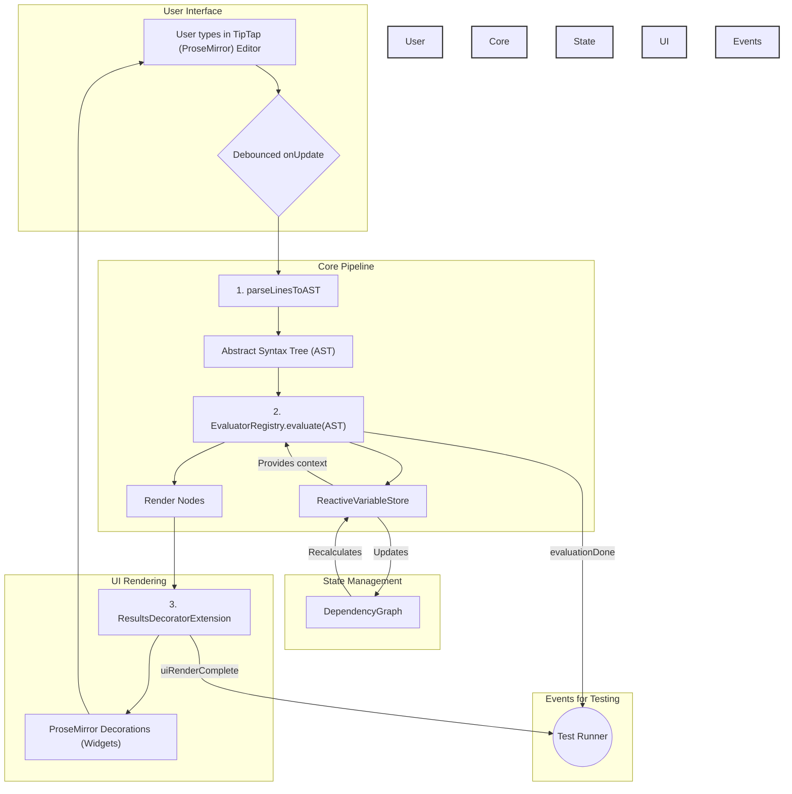

# SmartPad Architecture

This document provides a deep dive into the technical architecture of SmartPad. It is intended for developers who want to understand how the system works, from a user's keystroke to the final rendered output.

## The Core Philosophy: A Living Document
### blejrel elkrjer lekrj
#### blejrel elkrjer lekrj
##### blejrel elkrjer lekrj
###### blejrel elkrjer lekrj

SmartPad is designed as a "living document". This means that the user's text is the single source of truth, and the application reactively calculates and displays results based on that text. The core principles of the architecture are:

1.  **The user's text is immutable:** The application never changes the user's input directly. All results, errors, and UI elements are rendered as non-editable "decorations" on top of the text.
2.  **Reactivity:** The system is built around a reactive dependency graph. When a variable changes, all dependent expressions are automatically recalculated.
3.  **Extensibility:** The evaluation system is designed to be extensible, allowing for new types of calculations (like percentages, units, etc.) to be added easily.

## The Master Plan: From Keystroke to Result

The following diagram illustrates the entire data flow of SmartPad, from user input to the final rendered UI. The sections below will walk through each part of this diagram in detail.

## A Deep Dive into the Pipeline

### 1. Parsing: From Raw Text to an Abstract Syntax Tree (AST)

-   **Location:** `src/parsing/`
-   **Key Files:** `ast.ts`, `astParser.ts`

The process begins when the user types in the editor. After a brief debounce period, the `onUpdate` event triggers the core pipeline.

The first step is to parse the raw text of each line into a more structured format. This is the job of the **AST Parser**. The parser takes a line of text and determines its type, creating an **Abstract Syntax Tree (AST) node**.

The primary AST node types are:

-   `PlainTextNode`: A line without any recognized syntax.
-   `VariableAssignmentNode`: A line that assigns a value to a variable (e.g., `x = 10`).
-   `ExpressionNode`: A line that contains a mathematical expression to be evaluated (e.g., `10 + 5 =>`).
-   `CombinedAssignmentNode`: A line that both assigns a value and requests an evaluation (e.g., `y = 10 + 5 =>`).
-   `ErrorNode`: A line that the parser could not understand.

### 2. Evaluation: From AST to Renderable Results

-   **Location:** `src/eval/`
-   **Key Files:** `registry.ts`, `renderNodes.ts`, and various evaluator implementations.

Once we have an AST, the **Evaluator Registry** takes over. The registry is the central hub of the evaluation system. It maintains a list of specialized evaluators, each designed to handle a specific type of AST node.

The registry iterates through its list of evaluators in a predefined order of priority. For each AST node, it asks the evaluators, "Can you handle this?" The first evaluator that says "yes" gets to evaluate the node.

The default evaluator priority is:

1.  `PercentageExpressionEvaluator`: Handles percentage calculations.
2.  `UnitsNetExpressionEvaluator`: Handles expressions with units.
3.  `CombinedAssignmentEvaluator`: Handles `name = expression =>` patterns.
4.  `VariableEvaluator`: Handles variable assignments without `=>`.
5.  `ExpressionEvaluator`: Handles standard mathematical expressions.
6.  `ErrorEvaluator`: Handles nodes that have already been marked as errors.
7.  `PlainTextEvaluator`: Handles plain text nodes.

The output of an evaluator is a **Render Node**. A render node is a simple data structure that contains all the information needed to display a result in the UI, including the text to display and the position in the document where it should be rendered.

### The Reactive Core: State Management

-   **Location:** `src/state/`
-   **Key Files:** `variableStore.ts`, `dependencyGraph.ts`

As the evaluators process the AST, they interact with the **Reactive Variable Store**. This is the brain of SmartPad's state management.

When a variable assignment is evaluated, the store is updated. The store then uses a **Dependency Graph** to track the relationships between variables. For example, if `y = x + 1`, the graph knows that `y` depends on `x`.

When `x` is changed, the dependency graph identifies all the variables that depend on `x` (in this case, `y`) and triggers their recalculation. This reactive system ensures that the entire document is always consistent and up-to-date.

### 3. Rendering: Displaying the Results

-   **Location:** `src/components/`
-   **Key Files:** `ResultsDecoratorExtension.ts`

After the evaluation is complete, the core pipeline has a list of `RenderNodes`. These are passed to the **Results Decorator Extension**.

This extension is responsible for creating the UI widgets that display the results. It uses the information in the render nodes to create **ProseMirror Decorations**. These are non-editable DOM elements that are inserted into the editor view without modifying the underlying text. This is how we achieve the "living document" effect, where results appear next to the user's input without changing it.

### Enabling Deterministic Testing

-   **Key Files:** `Editor.tsx`, `ResultsDecoratorExtension.ts`

To make testing reliable, the system emits a series of events:

1.  `evaluationDone`: Fired after the evaluation is complete and the render nodes have been generated.
2.  `uiRenderComplete`: Fired after the `ResultsDecoratorExtension` has created and rendered the UI widgets.

Our test suites wait for these events to ensure that they are asserting against a stable and predictable state.

This architecture allows SmartPad to be a powerful and extensible tool for real-world calculations, while maintaining a simple and intuitive user experience.
